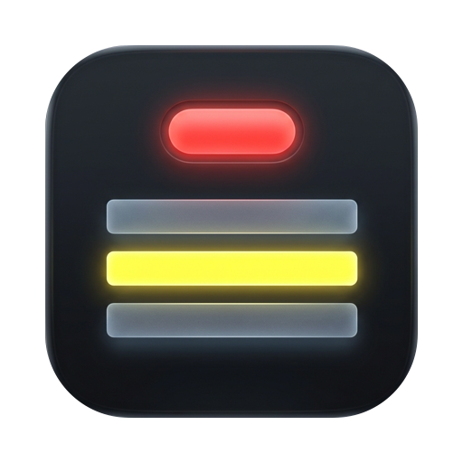
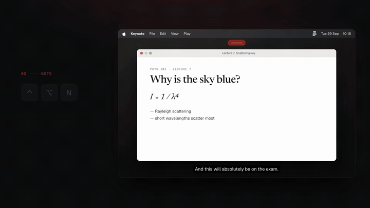

<p align="center"></p>

<h1 align="center">Notes Thing</h1>

<p align="center">Record anything on your Mac and take notes while you listen.<br>Meetings, lectures, calls, interviews, talks: every note lands in the transcript at the second you wrote it.</p>

<p align="center"><a href="https://notesthing.yoelgal.com">notesthing.yoelgal.com</a></p>

<p align="center"><a href="https://notesthing.yoelgal.com/assets/demo.mp4?v=2"></a><br><sub>▶ <a href="https://notesthing.yoelgal.com/assets/demo.mp4?v=2">Watch the demo with sound</a> · <a href="site/assets/demo-sound-credits.txt">sound credits</a></sub></p>

Transcribes on-device with Parakeet TDT v2 (via FluidAudio). UI adapted from [Hex](https://github.com/kitlangton/Hex) (MIT, see `LICENSE-Hex`).

## Install

Paste this into Terminal:

```sh
curl -fsSL https://notesthing.yoelgal.com/install.sh | bash
```

It downloads the latest release to `/Applications` and opens it. Look for the red-capsule icon in your menu bar.

Or with Homebrew: `brew install --cask yoelgal/tap/notes-thing`

Requires macOS 14 (Sonoma) or newer. The first run downloads the speech model (~650 MB).

<details>
<summary>Why a terminal command? / Manual install</summary>

Notes Thing isn't notarized by Apple (that needs a paid developer account). macOS blocks
unnotarized apps downloaded in a browser, but not ones fetched with `curl`, so the one-liner
just works. [Read the script](site/install.sh): it's 50 lines.

**Manual install:** download `NotesThing.zip` from the [latest release](https://github.com/yoelgal/notes-thing/releases/latest),
unzip it, and drag **Notes Thing** to Applications. The first time you open it, macOS will say it
can't verify the developer. Click **Done**, then go to **System Settings → Privacy & Security**,
scroll down, and click **Open Anyway**. You only need to do this once.

</details>

## Update

Notes Thing checks for updates daily and shows **Update to …** in the menu. Updates are signed with an EdDSA key (Sparkle), and one started mid-session waits until the session is transcribed. Running the install command again also works.

## Uninstall

Quit from the menu, then drag **Notes Thing** from Applications to the Trash. Your recordings stay in `~/Sessions`.

## Use
- `⌃⌥P`: start a session / pause / resume
- Calls and videos: Notes Thing records what your Mac plays as well as your mic (macOS 14.2+), so the other side of a call is transcribed even with headphones on. macOS asks for **System Audio Recording** permission the first time. Turn it off in **Settings → Audio Input**.
- `⌃⌥N`: note field (Enter saves, Esc cancels). A note is timed from its first keystroke.
- Change either shortcut, or the transcription model, in **Settings…** (`⌘,` from the menu).
- **History…** lists every session: play the audio, open the transcript, copy `/notes <id>`, or transcribe one you quit mid-recording.
- Menu bar → **Stop & Transcribe**: writes `~/Sessions/<id>/session.md` and copies `/notes <id>` to the clipboard.
- `/notes <id>` asks your AI agent about a session: it summarises it and explains each note in context. Install it with **Get Started → Install** in the app, or `npx skills add yoelgal/notes-thing --skill notes -g` (Claude Code, Codex, Cursor and other agents). Chat assistants: give them `session.md`.
- More than one voice? The transcript labels each change of speaker (**Speaker 1:**, **Speaker 2:**…). Name them with the people button in **History…**; giving two the same name merges them.

Sessions live in `~/Sessions` unless you pick another folder with **Settings → Sessions Folder → Change…**, which moves them for you. Don't move or rename the folder in Finder: History and `/notes` would lose track of it (the app will ask you to point it at the new place).

Each session folder: `events.jsonl` (written live), `audio.caf` while recording → `audio.m4a` after, `session.md`, and `speakers.json` (speaker names) when there's more than one voice.

Quit mid-session? The audio and notes are safe on disk; rebuild the transcript with
`"/Applications/Notes Thing.app/Contents/MacOS/NotesThing" --finish ~/Sessions/<id>`.

## Build from source

```sh
git clone https://github.com/yoelgal/notes-thing && cd notes-thing
scripts/build.sh              # → dist/Notes Thing.app
scripts/build.sh --install    # also copies it to /Applications
swift build --package-path app && app/.build/debug/NotesThing --selfcheck   # transcript + shortcut checks
swift scripts/icon.swift      # cut scripts/icon-art.png into the app icon and site icons
```

Needs Xcode 16+ (Swift 6). Releases are built by GitHub Actions from tags (`git tag v1.2.3 && git push --tags`).

The site (`site/`) deploys to Vercel; `site/install.sh` is served at `notesthing.yoelgal.com/install.sh`.
